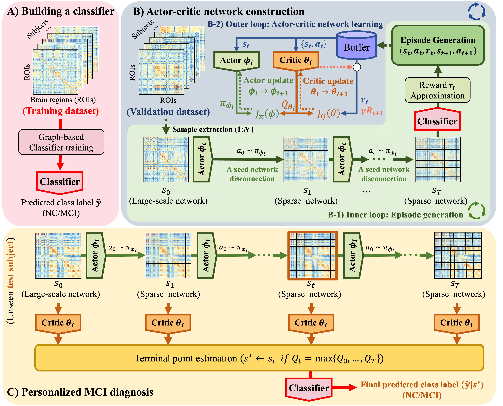

# 🧠 Sparse Graph Representation Learning for Personalized MCI Diagnosis

[](https://www.python.org/)
[](https://pytorch.org/)
[](https://cython.org/)
[](https://ieeexplore.ieee.org/document/10509746)

Official PyTorch implementation of **"Sparse Graph Representation Learning based on Reinforcement Learning for Personalized Mild Cognitive Impairment (MCI) Diagnosis"**, accepted to **IEEE Journal of Biomedical and Health Informatics (JBHI), 2024**.

## 📌 Overview

Resting-state functional MRI can be represented as a functional connectivity network (FCN), where each edge describes synchronized activity between brain regions. This project implements a reinforcement-learning-based framework that constructs subject-specific sparse graph representations for personalized MCI diagnosis.

The framework decomposes FCN construction into smaller sub-problems, improves exploration with a divide-and-conquer strategy, and uses the learned value function to determine subject-specific sparsity levels.

<p align="center">
  
</p>

## ✨ Key Features

- **Personalized FCN sparsification** for mild cognitive impairment diagnosis
- **Reinforcement learning based edge/ROI selection** over functional connectivity graphs
- **Divide-and-conquer exploration** to reduce the search space during training
- **Value-function-guided sparsity control** for subject-specific graph construction
- **Cython-accelerated modules** for self-play, action selection, utility functions, and evaluation
- **Baseline pipelines** for comparison with general graph classification models

## 📁 Project Structure

```text
.
├── README.md                         # Project documentation
├── setup.py                          # Cython extension build script
├── package.txt                       # Original dependency list
├── requirements.txt                  # Curated install list for reproducible setup
├── configs/
│   ├── path.txt                      # Local project/data root path
│   └── hyperparameter.txt            # Example/default hyperparameter file
├── docs/
│   └── assets/                       # Figures used by README/docs
└── src/
    └── mci_rl/
        ├── config.py                 # Shared CLI/runtime configuration
        ├── Train_Test.py             # Data split and preprocessing utility
        ├── Baseline.py               # Baseline model entry point
        ├── General_baseline.py       # General baseline training pipeline
        ├── train_cycle.py            # Main iterative RL training cycle
        ├── train_network.pyx         # Dual-network training logic
        ├── self_play_best.pyx        # Self-play data generation
        ├── DualNetwork.pyx           # Actor-critic style dual network
        ├── Action.pyx / Action_lap.pyx
        ├── disconnection*.pyx
        ├── evaluate_best_player_val_p.pyx
        ├── util.pyx / gcn_util.pyx
        └── early_stop*.py
```

## 🚀 Quick Start

### 1. Clone

```bash
git clone https://github.com/BitAdventurer/A-Novel-Personalized-MCI-Diagnosis-Framework-with-RL.git
cd A-Novel-Personalized-MCI-Diagnosis-Framework-with-RL
```

### 2. Create an environment

```bash
conda create -n mci-rl python=3.11 -y
conda activate mci-rl
```

### 3. Install dependencies

```bash
pip install -r requirements.txt
```

The original dependency snapshot is also available in `package.txt`.

### 4. Build Cython extensions

```bash
python setup.py build_ext --inplace
```

### 5. Configure local paths

Edit `configs/path.txt` so that the first line points to the local project/data root used by the training scripts.

```text
/absolute/path/to/project_or_data_root
```

## 🧬 Data Preparation

The dataset files are not included in this repository because of storage and access restrictions. The experiments use ADNI2, ADNI3, and ADNI GO cohorts from the Alzheimer's Disease Neuroimaging Initiative:

- [ADNI data portal](http://adni.loni.usc.edu)

The scripts expect preprocessed data and generated fold files under the local root configured in `configs/path.txt` or `--path`. A typical working directory contains generated folders such as:

```text
data/
├── fold0/
├── fold1/
└── ...

train_dual_network/
├── best.pt
├── best2.pt
├── target.pt
└── target2.pt
```

## ⚙️ Usage

### Build compiled modules

Run this after installing dependencies and whenever a `.pyx` file changes:

```bash
python setup.py build_ext --inplace
```

### Generate train/validation/test splits

```bash
PYTHONPATH=src python -m mci_rl.Train_Test --path /absolute/path/to/project_or_data_root
```

`mci_rl.Train_Test` is a legacy preprocessing utility and assumes that local ADNI-derived input files are available in the expected locations.

### Run baseline models

```bash
PYTHONPATH=src python -m mci_rl.Baseline --path /absolute/path/to/project_or_data_root
PYTHONPATH=src python -m mci_rl.General_baseline --path /absolute/path/to/project_or_data_root
```

### Run the RL training cycle

```bash
PYTHONPATH=src python -m mci_rl.train_cycle --path /absolute/path/to/project_or_data_root --cuda_device 0
```

Weights, replay buffers, validation outputs, and logs are written under the path configured by `--path` and `configs/path.txt`.

## 🔧 Configuration

Most runtime settings are defined in `src/mci_rl/config.py` and can be overridden from the command line.

Common options:

```bash
--path                  Local project/data root
--cuda_device           CUDA device index
--seed                  Training seed
--dataset_seed          Dataset split seed
--n_split               Number of cross-validation splits
--split                 Active validation split
--fold                  Active outer fold
--stop_point            Episode stopping point
--sp_game_count         Self-play game count
--batch_size            Training batch size
--lr                    Learning rate
--buffer_size           Replay buffer size
--optimizer             Optimizer name: Adam, SGD, RMSprop, RAdam, MADGRAD
```

Example:

```bash
PYTHONPATH=src python -m mci_rl.train_cycle \
  --path /absolute/path/to/project_or_data_root \
  --fold 0 \
  --split 0 \
  --cuda_device 0 \
  --seed 42
```

## 📊 Outputs

Depending on the selected workflow, the code writes artifacts such as:

- trained dual-network checkpoints under `train_dual_network/`
- replay-buffer and self-play histories under `self_play_backup/` and `self_play_best_data/`
- baseline checkpoints and JSON results under `baseline/`
- value, policy, reward, and terminal logs under `result/`, `terminal/`, and `value/`
- optional Weights & Biases logs when `wandb` is configured

## 📚 Citation

If this repository is useful for your research, please cite:

```bibtex
@article{ji2024sparse,
  author={Ji, Chang-Hoon and Shin, Dong-Hee and Son, Young-Han and Kam, Tae-Eui},
  journal={IEEE Journal of Biomedical and Health Informatics},
  title={Sparse Graph Representation Learning based on Reinforcement Learning for Personalized Mild Cognitive Impairment (MCI) Diagnosis},
  year={2024},
  pages={1-12},
  keywords={Task analysis;Topology;Brain modeling;Bioinformatics;Supervised learning;Reinforcement learning;Network topology;Reinforcement Learning;Brain Disease Diagnosis;MCI;Functional Connectivity Network},
  doi={10.1109/JBHI.2024.3393625}
}
```

## 🙏 Acknowledgements

This work was supported by Institute of Information & communications Technology Planning & Evaluation (IITP) grant (No. 2019-0-00079, Artificial Intelligence Graduate School Program(Korea University), No. 2022-0-00871, Development of AI Autonomy and Knowledge Enhancement for AI Agent Collaboration), and the National Research Foundation of Korea (NRF) grant funded by the Korea government (MSIT) (No.RS202300212498).

## 📬 Contact

This repository was published through the official MAILAB account, and the issues tab has been disabled. For questions or implementation problems, please contact:

- Chang-Hoon Ji: ckdgns0611@korea.ac.kr
- Dong-Hee Shin: dongheeshin@korea.ac.kr
- Young-Han Son: yhson135@korea.ac.kr

Official GitHub accounts can also be found in the contributors list.

## 📄 License

No license file is currently included in this repository. Please contact the authors before reusing the code beyond paper reproduction or academic reference.
